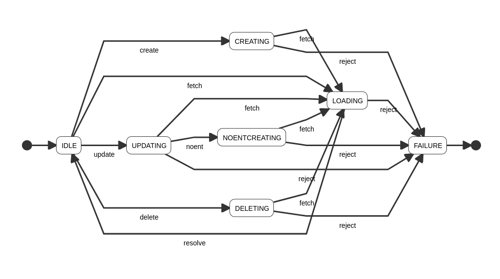

This project was bootstrapped with [Create React App](https://github.com/facebook/create-react-app).

## APP DIAGRAM



## STATE TRANSITION TABLE 

| state         | input   | next state    |
|---------------|---------|---------------|
| IDLE          | create  | CREATING      |
| IDLE          | fetch   | LOADING       |
| IDLE          | update  | UPDATING      |
| IDLE          | delete  | DELETING      |
| CREATING      | fetch   | LOADING       |
| CREATING      | reject  | FAILURE       |
| NOENTCREATING | fetch   | LOADING       |
| NOENTCREATING | reject  | FAILURE       |
| UPDATING      | fetch   | LOADING       |
| UPDATING      | noent   | NOENTCREATING |
| UPDATING      | reject  | FAILURE       |
| DELETING      | fetch   | LOADING       |
| DELETING      | reject  | FAILURE       |
| LOADING       | reject  | FAILURE       |
| LOADING       | resolve | IDLE          |
| FAILURE       |         |               |


###  STATE DESCRIPTION


``` javascript
const NEXTSTATE = {
    STATE: {
      event: {
         status: NEXTSTATE,
         // ...
      }
    }
}
```

### STATE OBJECT


``` javascript
const NEXTSTATE = {
      IDLE: {
          fetch:  {
              ...state,
              status:  'LOADING',
              isInputDisabled: true 
          }, 
          create: { 
              ...state,
              status:  'CREATING',
              isInputDisabled: true 
          },
          update: {
              ...state,
              status:  'UPDATING',
              id: event.id,
              isInputDisabled: true 
          },
          delete: {
              ...state,
              status:  'DELETING',
              id: event.id,
              isInputDisabled: true 
          }
      },

      CREATING: {
          fetch:  {
              ...state,
              status:  'LOADING',
          }, 
          reject:  {
              ...state,
              status: 'FAILURE',
              error: event.error
          }
      },

      NOENTCREATING: {
          fetch:  {
              ...state,
              status:  'LOADING'
          }, 
          reject:  {
              ...state,
              status: 'FAILURE',
              error: event.error
          }
 
      },
 
      UPDATING: {
          fetch:  {
              ...state,
              status:  'LOADING',
          }, 
          noent:  {
              ...state,
              status:     'NOENTCREATING',
              noEntQuery:  event.noEntQuery,
              isCompleted: event.isCompleted
          },
          reject:  {
              ...state,
              status: 'FAILURE',
              error: event.error
          }
     },

      DELETING: {
          fetch:  {
              ...state,
              status:  'LOADING'  
          }, 
          reject:  {
              ...state,
              status: 'FAILURE',
              error: event.error
          }
      },

      LOADING: {
          resolve: {
              ...state,
              status: 'IDLE',
              data: event.data,
              isInputDisabled: false
          },
          reject:  {
              ...state,
              status: 'FAILURE',
              error: event.error

          }
      },

      FAILURE: {}
};

```

## GETTING THE  NEXT STATE
   

``` javascript
 const nextState = NEXTSTATE[state.status][event.type];
 return nextState !== undefined ? nextState : state;
```

## ACTIONS AND DISPATCH
  
| state         | action        |
|---------------|---------------|
| CREATING      | create()      |
| NOENTCREATING | noEntCreate() |
| LOADING       | read()        |
| UPDATING      | update()      |
| DELETING      | remove()      |


The actions(create, noEntCreate, read, update and remove) are async functions that are called inside =useEffect= and they also dispatch the events. 

The only dependency in the dependency array is =state.status= and this generate a warning:


> React Hook useEffect has missing dependencies: 'query' and 'state.id'. Either include them or remove the dependency array  react-hooks/exhaustive-deps


This is because React wants to avoid update inconsistencies. React is watching for 'data' changes (query, state.id) but I want to focus in =state= changes (at the moment I'm ignoring this warning because I can't identify a problem in the app with the current approach).
 

``` javascript
   // CREATE   
   if(state.status === 'CREATING' ) {
     create();
   }

   if(state.status === 'NOENTCREATING' ) {
     noEntCreate();
   }

   // READ
   if(state.status === 'LOADING') {
     read();
   }

   // UPDATE 
   if(state.status === 'UPDATING' ) {
      update();
   }

   // DELETE
   if(state.status === 'DELETING' ) {
      remove();
   }

  }, [state.status]);

```


### Functions

- Create


``` javascript
async  function create() {
    try {
        await axios
                  .post(
                      SERVERURL,
                      {
                          data: query,
                          isCompleted: false 
                      });
        await setQuery('');
        await dispatch({type: 'fetch'});
    } catch(error) {
        await dispatch({type: 'reject',  error});
    }
 }

async  function noEntCreate() {
    try {
        await axios
                  .post(
                      SERVERURL,
                      {
                          data: state.noEntQuery,
                          isCompleted: state.isCompleted
                      }
                  );
        await dispatch({type: 'fetch'});
    } catch(error) {
        await dispatch({type: 'reject',  error});
    }
 }
``` 

- Read


``` javascript
async  function read() {
       try {
         const res  = await axios.get(SERVERURL);
         const data = await res.data.data;
         await dispatch({type: 'resolve',  data});
       } catch(error) {
          await dispatch({type: 'reject',  error});
       }
    }
``` 

- Update


``` javascript
async  function update() {
   try {
     await axios.put(SERVERURL, {id: state.id});
     await dispatch({type: 'fetch'});
   } catch(error) {
       if(error.message === 'Request failed with status code 409') {
         let noEntTodo   = await state.data.filter( todo => todo._id === state.id);  
         let noEntQuery  = await noEntTodo[0].data;
         let isCompleted = await !noEntTodo[0].isCompleted;
         await dispatch({type: 'noent', noEntQuery, isCompleted });
       } else { 
         await dispatch({type: 'reject',  error});
       }
   }
}
```

- Remove (Delete)


``` javascript
async  function remove() {
      try {
          await axios({
              method: 'DELETE',
               url: SERVERURL,  
                headers: {
                  Accept: 'application/json',
                  'Content-Type': 'application/json'
                },
              data: {
                  id: state.id
              }
             });
         await dispatch({type: 'fetch'});
      } catch(error) {
         await dispatch({type: 'reject',  error});
      } 
  }

```


   


